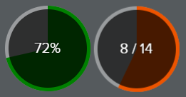

# ngx-heyl-progressbar

This package allows you to use a progressbar and a radial-progress element in AngularX (2+) projects.
#### Please don't hesitate to ask for new features or report a bug on Github! Thanks

### `progressbar` component example :


### `radial-progress` component example :


# 1. Installation

#### 1.1 Install npm module : 

   `npm install ngx-heyl-progressbar`

#### 1.2 Import the module :

   Open your `app.module.ts` file and import the module like this :
   
   ```typescript
   import { ProgressbarModule } from "ngx-heyl-progressbar";
   @NgModule({
      imports: [ 
         ...,
         ProgressbarModule
      ]
   })
   ```

# 2. Small wiki

Know that ProgressbarComponent and RadialProgressComponent has the same super-class :
AbstractProgressComponent. All inputs are declared inside this class.

### Inputs available for `AbstractProgressComponent`:

| Inputs | Default value | Description |
| -------| --------------| ----------- |
| `value` | `0` | Value of the progressbar |
| `max` | `100` | Max value of the progressbar |
| `progressType` | `"none"` | Define the text displayed inside the progressbar |
| `Config` | `new ProgressbarConfig()` | Set multiple properties in one property |
| `color1` | `101` | Rate after which the class `.color1` will be set to the progressbar |
| `color2` | `101` | Rate after which the class `.color2` will be set to the progressbar |
| `color3` | `101` | Rate after which the class `.color3` will be set to the progressbar |

### Values of type `ProgressType`:

| Value | Description |
| -------| ----------- |
| `none` | Don't display any value |
| `percent` | Display a the percent value (40%) |
| `percent-progressive` | Display the percent value with text animation from current-percent-value to new-percent-value |
| `value` | Display a the percent value (40 / 100) |
| `value-progressive` | Display the value with text animation from current-value to new-value |
| `ng-content` | Display the ng-content |


# 3. `progressbar` component
### 3.1 Small wiki

### Inputs available for `progress-container`:

| Inputs | Default value | Description |
| -------| --------------| ----------- |
| `step` | `100` | How many ticks should be displayed when the progressbar has the class ".stepped". Step value will be *2 until it's > 3% |
| `force-step` | `step` | How many ticks should be displayed when the progressbar has the class ".stepped". |

### CSS classes for `progress-container`:

| Class | Description |
| -------| ----------- |
| `.stepped` | Prints a tick every step |

### CSS classes  for `progressbar`:

| Class | Description |
| -------| ----------- |
| `.stripped` | Add an animated background on the .progress element |
| `.no-animate` | Keep the background from `.stripped` or `.stripped-reverse`, without any move |
| `.stripped-reverse` | Add an animated background on the .progress element moving on the other side |

### 3.2 Then use `<progressbar>` component :

   ```html
   <progress-container>
       <progressbar [value]="'20'" [max]="'40'" class="stripped"></progressbar>
   </progress-container>
   <progress-container class="stepped" [step]="'10'">
       <progressbar [value]="'20'" class="stripped"></progressbar>
       <progressbar [value]="'50'" class="class=stripped-reverse""></progressbar>
   </progress-container>
   ```
      
### 3.3 Styling progressbar component

   You can declare the style you want for the progressbar. Here is an example :
   
   ```scss
    progress-container {
       /* background element */
       background-color: rgba(0, 0, 0, 0.4);   
    
       > .progressbar {
          color: #fff;
          
          &.default {
             /* Progress bar when the progress class is default */
             background-color: green;
          }

          &.color1 {
             /* Progress bar when the progress class is color1 */
             background-color: orange;
          }    
    
          ...
       }
    }
   ```
   
# 4. `radial-progress` component
### 4.1 Then use `<progressbar>` component :
   
  ```html
   <radial-progress value="5" max="10" progressType="ng-content">
       50% | 5/10
   </radial-progress>
   <radial-progress [value]="'7'" color1="33" color2="66" max="14" progressType="value-progressive"></radial-progress>
  ```
         
### 4.2 Styling progressbar component
   
  You can declare the style you want for the progressbar. Here is an example :
  
  ```scss
   radial-progress {
     &.default .fill {
        /* Progress when the progress class is default */
        background-color: green;
     }

     &.color1 .fill {
        /* Progress when the progress class is color1 */
        background-color: orange;
     }    

     ...
   }
  ```